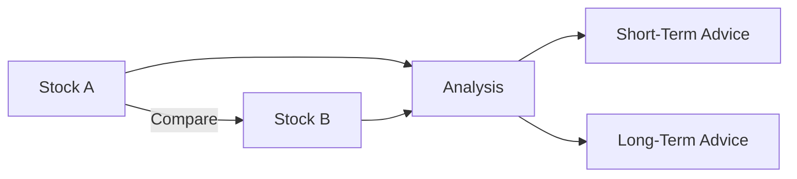

# LLM-Apps

Here's a more visually appealing and engaging version of the README with effects and visualizations included. It uses markdown techniques to make the content interactive, structured, and aesthetically pleasing.

---

# 🌟 **Interactive AI-Powered Applications Showcase** 🌟

Welcome to the repository of cutting-edge AI applications leveraging **Generative AI**, **Gemini LLM**, and **LangChain** technologies. Each project is crafted to demonstrate the power of state-of-the-art AI models in solving real-world problems with creativity and precision.

---

## 🎯 **Applications Overview**

### 1️⃣ **📄 ATS Resume Evaluator**
> Transform your resume to stand out in a competitive market.  

✨ **Features**:  
- Upload your resume in PDF format.  
- Paste the Job Description (JD).  
- Get precise **matching percentage**, **missing keywords**, and a tailored **profile summary**.  

🚀 **Tech Stack**: `Google Gemini LLM`, `Streamlit`, `PyPDF2`, `Python`.  

🔍 **How It Works**:  
1. Parse text from the uploaded resume PDF.  
2. Compare resume content with the JD using a skilled ATS-like evaluation engine.  
3. Get actionable suggestions to optimize your resume.

  

---

### 2️⃣ **📈 Real-Time Stock Analysis**
> Predict and analyze stock trends based on real-time data and news.  

✨ **Features**:  
- Analyze current market sentiment, stock movements, and trends.  
- Get detailed company news and industry trends for informed decisions.  

🚀 **Tech Stack**: `Yahoo Finance`, `DuckDuckGo Search`, `Google Gemini LLM`, `Python`.  

🔍 **How It Works**:  
1. Fetch stock data for a given company ticker symbol.  
2. Aggregate the latest company and industry news.  
3. Predict short- and long-term trends with Gemini-powered insights.

  

---

### 3️⃣ **📊 Stock Comparison & Insights**
> Compare multiple stocks to identify the best investment options.  

✨ **Features**:  
- Compare stock performance metrics like price, market cap, and previous close.  
- Analyze company news and identify risks and opportunities.  
- Get recommendations for both short- and long-term investments.  

🚀 **Tech Stack**: `Yahoo Finance`, `DuckDuckGo Search`, `Google Gemini LLM`, `Python`.  

🔍 **How It Works**:  
1. Fetch stock details for multiple companies.  
2. Generate a comprehensive comparative analysis.  
3. Provide investment advice based on real-time data.

📊 **Visualization**:  


---

### 4️⃣ **🤖 Q&A Chatbot**
> A conversational AI application powered by Gemini LLM.  

✨ **Features**:  
- Interactive question-and-answer system.  
- Engaging chatbot with dynamic responses.  

🚀 **Tech Stack**: `Streamlit`, `Google Gemini LLM`, `Python`.  

🔍 **How It Works**:  
1. Start an interactive chat session.  
2. Input your queries and get precise responses.  
3. Review chat history for context.


---

### 5️⃣ **🦙 LangChain + Ollama Chatbot**
> A next-gen chatbot application using **LangChain** and **Llama2 APIs**.  

✨ **Features**:  
- Handles complex queries with structured responses.  
- Connects to Llama2 API via LangChain for enhanced conversational depth.  

🚀 **Tech Stack**: `LangChain`, `Ollama`, `Streamlit`, `Python`.  

🔍 **How It Works**:  
1. Build a conversational flow with LangChain.  
2. Utilize Llama2 APIs for context-aware and accurate responses.  
3. Generate dynamic and insightful outputs.

---

## 📂 **Folder Structure**

```plaintext
📁 root/
├── 📂 src/
│   ├── ats_resume_evaluator.py
│   ├── stock_analysis.py
│   ├── stock_comparison.py
│   ├── qna_chatbot.py
│   ├── langchain_chatbot.py
├── 📁 assets/
│   ├── ats_visual.png
│   ├── stock_analysis_visual.png
│   ├── qna_chatbot_visual.png
├── 📄 requirements.txt
├── 📄 README.md
```

---

## 🚀 **Getting Started**

### **1️⃣ Prerequisites**
- Python 3.8 or later  
- Install dependencies:  
  ```bash
  pip install -r requirements.txt
  ```

### **2️⃣ Setup API Keys**
- Add the following keys to a `.env` file:  
  ```plaintext
  GEMINI_API_KEY=your_google_gemini_api_key
  LANGCHAIN_API_KEY=your_langchain_api_key
  ```

### **3️⃣ Run Applications**
- Launch individual applications:  
  ```bash
  streamlit run src/<app_name>.py
  ```

---

## 📊 **Visualizing Data**

Enhance your analysis with visualizations:  
- 📈 Line graphs for stock price trends.  
- 🗂️ Comparative tables for stock analysis.  
- 💬 Interactive chat history for chatbots.

### Example Visualization:
```python
import matplotlib.pyplot as plt

def plot_stock_trends(prices, labels):
    plt.figure(figsize=(10, 6))
    for price, label in zip(prices, labels):
        plt.plot(price, label=label)
    plt.legend()
    plt.title("Stock Price Trends")
    plt.show()
```

---

## 👥 **Contributing**
We welcome contributions! Feel free to submit issues or pull requests.

---

## 🛠️ **Technologies Used**
- **Programming Language**: Python  
- **Libraries**: Google Generative AI, LangChain, Yahoo Finance, DuckDuckGo Search, Streamlit  
- **API Models**: Gemini LLM, Ollama  

---

## 🏆 **Future Enhancements**
- 📊 Adding interactive dashboards with **Plotly**.  
- 🤝 Integration with social media sentiment analysis.  
- 🔮 Predictive models for long-term forecasting.  

---
